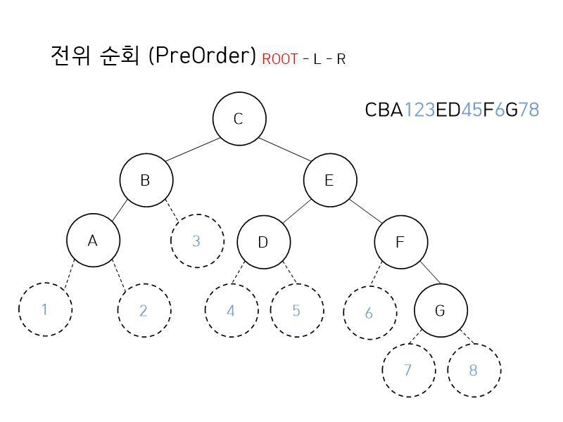

# 트리 순회
- 전위 순회(preorder)
- 중위 순회(inorder)
- 후위 순회(postorder)

## 전위 순회
1. 노드를 방문
2. 왼쪽 서브 트리를 전위 순회
3. 오른쪽 서브 트리를 전위 순회
- DFS 와 동일
```C++
struct node {
  char data;
  struct node *left;
  struct node *right;
} Node;

void printPreorder (Node *root) {
  // 노드가 없다면 종료한다.
  if (root == NULL)
    return;

  // root data를 출력(방문)한다.
  printf("%c ", root->data);
  
  // 왼쪽 서브트리로 재귀한다.
  printPreorder(root->left);
  
  // 오른쪽 서브트리로 재귀한다.
  printPreorder(root->right);
}
```

## 중위 순회
1. 왼쪽 서브 트리를 중위 순회한다.
2. 노드를 방문한다.
3. 오른쪽 서브 트리를 중위 순회한다.
- 대칭 순회(symetric) 이라고도 부름
```C++
struct node {
  char data;
  struct node *left;
  struct node *right;
} Node;

void printInorder (Node *root) {
  // 노드가 없다면 종료한다.
  if (root == NULL)
    return;

  // 왼쪽 서브트리로 재귀한다.
  printInorder(root->left);

  // root data를 출력(방문)한다.
  printf("%c ", root->data);
  
  // 오른쪽 서브트리로 재귀한다.
  printInorder(root->right);
}
```

## 후위 순회
1. 왼쪽 서브 트리를 후위 순회한다.
2. 오른쪽 서브 트리를 후위 순회한다.
3. Root 노드를 방문한다.
```C++
struct node {
  char data;
  struct node *left;
  struct node *right;
} Node;

void printPostorder (Node *root) {
  // 노드가 없다면 종료한다.
  if (root == NULL)
    return;

  // 왼쪽 서브트리로 재귀한다.
  printPostorder(root->left);

  // 오른쪽 서브트리로 재귀한다.
  printPostorder(root->right);

  // root data를 출력(방문)한다.
  printf("%c ", root->data);
}
```

## Tip

- 만약 잘 이해가 되지 않는다면 모든 노드에 왼쪽 자식과 오른쪽 자식을 임의로 그려놓고 탐색
- 결과 CBA123ED45F6G78 에서 숫자들을 뺀다면 전위 순회 결과가 나옴

## Reference
- [Wikipedia - 트리 순회](https://ko.wikipedia.org/wiki/%ED%8A%B8%EB%A6%AC_%EC%88%9C%ED%9A%8C)
- [Boj - 1991번 트리 순회](https://www.acmicpc.net/problem/1991)
- [블로그 - 트리 순회](https://withhamit.tistory.com/282)