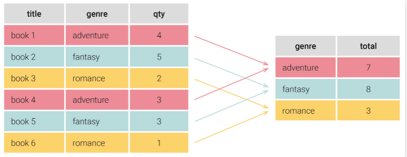

# GROUP BY
- 주로 집계 함수들과 함께 사용 (COUNT, AVG, MIN, MAX, SUM ...)
- 데이터를 유형별로 그룹화하여 다루기 위함
    - 같은 값을 가진 행끼리 하나의 그룹으로 합친다


## HAVING
- 컬럼을 그룹화한 결과에 조건을 거는 조건문
- WHERE 문은 그룹화 하기 이전에 조건을 거는 조건문

## 사용법
1. 기본 사용법
```SQL
SELECT COL1, COL2, COL3
FROM TABLE_1
GROUP BY COL1
```
2. 조건 처리 후 그룹화
```SQL
SELECT COL1, COL2, COL3
FROM TABLE_1
WHERE 조건식
GROUP BY COL1
```
3. 그룹화 후 조건 처리
```SQL
SELECT COL1, COL2, COL3
FROM TABLE_1
GROUP BY COL1
HAVING 조건식
```
4. 2번 + 3번
```SQL
SELECT COL1, COL2, COL3
FROM TABLE_1
WHERE 조건식1
GROUP BY COL1
HAVING 조건식2
```

## Reference
https://extbrain.tistory.com/56  
https://kimsyoung.tistory.com/entry/SQL-GROUP-BY-%E4%B8%8A-%EA%B0%9C%EB%85%90%EA%B3%BC-%EC%8B%A4%EC%A0%9C-%EC%A0%81%EC%9A%A9-%EB%B0%A9%EB%B2%95