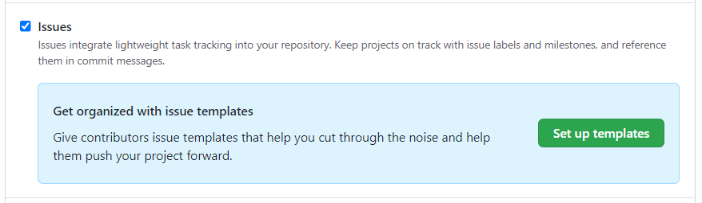
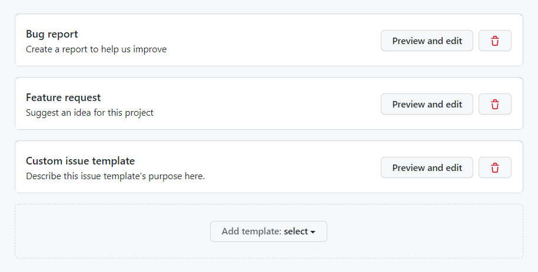
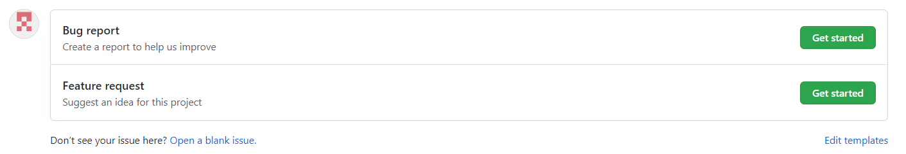
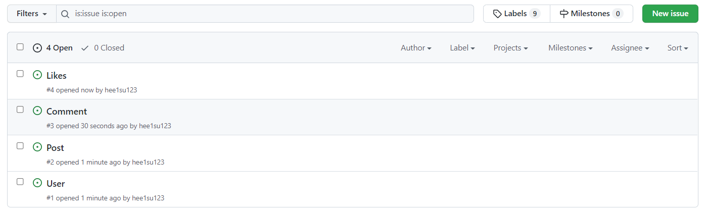

## Issues
- 새로 추가될 기능, 개선 해야할 기능, 버그 등 모든것이 이슈라고 본다. 모든 활동 내역에 대해서 이슈를 등록하고 그 이슈를 기반으로 작업을 진행한다

### Issues 추가하기

- Settings -> Features -> Issues -> Set up Templates

- Issue Template 를 필요에 따라 자유롭게 생성한다

- 작성된 템플릿에 알맞는 이슈 생성

- User, Post, Comment, Like 이슈 생성

### Issues 사용하기
- Github Issue는 각자의 유니크한 값 Issue Number를 갖습니다. 또 그 Iusse Number 기반으로 Branch를 이름을 같게 하여 해당 Branch의 명확한 작업의 의도를 갖게 할 수 있습니다.

- Assigness: 해당 작업의 담당자 
- Labels: 해당 작업의 성격
- Milestone: 해당 작업이 속한 파트