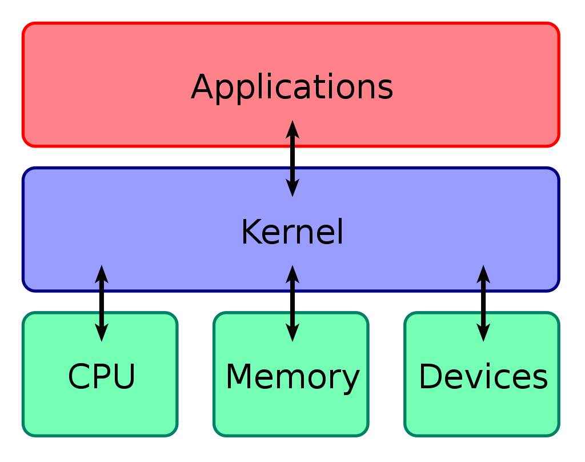

# Kernel(커널)

- 운영체제의 핵심 프로그램으로, 시스템의 모든 것을 통제
- CPU 에 명령을 내리는 소프트웨어
- 운영체제에의 핵심부로 컴퓨터 자원 등을 관리하는 역할
    - 컴퓨터의 자원을 바라보기 때문에 사용자와 상호작용을 지원하지 않음
    - 시스템 프로그램 Shell(시스템콜의 일종)과 같은 소프트웨어를 통해 사용자와 커널이 상호작용 가능
- 기능
    - 메모리 관리
    - 프로세스 관리
    - 장치 드라이버
    - 시스템 호출 및 보안

## 관련 내용
[시스템 콜](./System_Call.md)

## Reference
- 책 '면접을 위한 CS 전공지식노트
- [WIkipedia - Kernel](https://ko.wikipedia.org/wiki/%EC%BB%A4%EB%84%90_(%EC%BB%B4%ED%93%A8%ED%8C%85))
- [Red Hat - Linux Kernel](https://www.redhat.com/ko/topics/linux/what-is-the-linux-kernel)
- [블로그 - Kernel](https://medium.com/@su_bak/os-%EC%BB%A4%EB%84%90-kernel-%EC%9D%B4%EB%9E%80-b6b8aae8d0b4)