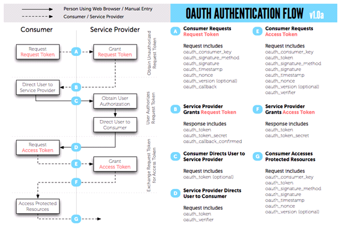

# OAuth (Open Authorization)
- 비밀번호를 제공하지 않고 다른 웹사이트 상의 자신의 정보에 대해 웹사이트나 애플리케이션의 접근 권한을 부여할 수 있는 공통적인 수단으로 사용되는, 접근 위임을 위한 '개방형 표준'(위키백과)

## OAuth 1.0
- User(사용자) : 서비스 제공자와 소비자를 사용하는 개인
- Service Provider(서비스 제공자) : OAuth Open Api 서비스를 제공하며, Consumer 가 제어하고자 하는 자원을 보유하고 있는 서버(Naver, Kakao etc.)
- Consumer(소비자) : 제공되는 Open Api 를 이용해 OAuth 를 사용하여 서비스 제공자에 접근하는 웹사이트/애플리케이션
- Request Token : Consumer 가 Service Provider 에게 접근 권한을 인증 받기 위해 사용하는 토큰. 인증 완료 후 Access Token 으로 교환됨
- Access Token : 인증 후 Consumer 가 Service Provider 의 자원에 접근하기 위한 키를 포함한 토큰

- 과정 : Request Token의 요청과 발급  
-> 사용자 인증 페이지 호출  
-> 사용자 로그인 완료  
-> 사용자의 권한 요청 및 수락  
-> Access Token 발급  
-> Access Token을 이용해 서비스 정보 요청

## OAuth 2.0
- 

## Reference
https://d2.naver.com/helloworld/24942