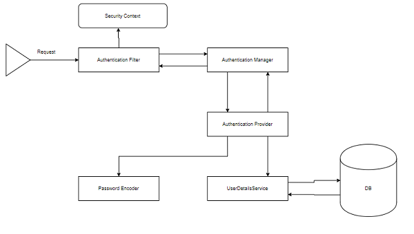

## SpringSecurity Architecture

  

### AuthenticationFilter
- 요청을 가로채고 인증을 시도하는 필터. 
- Spring Security에서는 요청을 Authentication Object로 변환하고 Authentication Manager에 인증을 위임한다.
### AuthenticationManager
- 인증을 위한 주요 전략 인터페이스. 
- 메서드 authenticate()를 사용하여 요청을 인증하고, 성공 시 Authentication Object 를 반환 실패 시 AuthenticationException 를 throw 한다.
- 인증 프로세스를 그 이후 AuthenticationProvider 로 위임
- AuthenticationManager 은 여러 AuthenticationProvider 에게 프로세스를 위임하는 ProviderManager 을 구현한 클래스이다.
### AuthenticationProvider
- AuthenticationProvider 을 구현하는 클래스는 항상 authenticate(), supports() 두개의 메서드를 구현해야한다.
- supports() : 특정 인증 유형이 AuthenticationProvider 구현 클래스에서 지원되는지 확인한다. 지원되는경우 true, 아닌 경우 false 를 반환한다.
- authenticate() : 인증을 절차를 진행하는 메서드. 인증 유형이 지원되어 true 를 반환한 경우 인증 프로세스를 진행.
- UserDetailsService 클래스의 loadUserByUsername 메서드를 사용하여 사용자 정보를 DB 에서 찾는다. 
    - 못 찾은 경우 UsernameNotFoundException 을 throw
    - 찾은 경우 받은 정보와 DB 에서 찾은 정보를 비교해 인증을 진행
    - 인증 진행 후 Authentication Object 를 반환하며 나중에 Security Context 에 저장된다.
### UserDetailsService
- 대부분의 인증 요청은 UserDetailsService 를 구현 한 방법에 따라 좌우된다.
- 사용자 데이터를 검색하기 위해 데이터베이스 기반 인증에 가장 일반적으로 사용된다.
- 데이터는 사용자에 대한 사용자 세부 정보를 가져오는 loadUserByUsername() 메서드를 구현하여 검색된다.
### Spring Security Context
- 인증이 성공 시 인증된 사용자 정보가 저장되는 장소.
- 저장된 이후 authentication object 는 프로그램 전반에 걸쳐 사용이 가능하다.
- 유저상세 정보를 받기 위해서는 일단 Security Context 가져와야한다.
- 이 작업은 보안 컨텍스트에 대한 액세스를 제공하는 도우미 클래스인 SecurityContextHolder를 사용하여 수행된다.
- setAuthentication() 를 이용해 정보를 저장하고 getAuthentication() 를 사용하여 검색한다.
