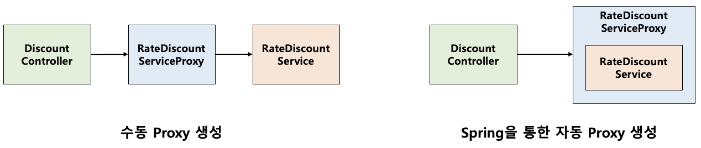

# Spring AOP Proxy

## Spring Proxy
- 프록시는 원래의 객체를 감싸는 같은 타입의 객체
- 접근제어, 부가 기능을 위해 사용 
- Spring AOP 에서 사용되는 패턴으로 수동으로 AOP 의 프록시를 구현 시 생기는 문제점으로 인해 두가지 방식을 지원
    - 문제점 
        - AOP 기능에 대해 불필요하게 두개의 빈을 등록해야함
        - DI 시 Bean 관리가 번거로워짐
    - JDK Dynamic Proxy
    - CGLIB

## JDK Dynamic Proxy

- JDK Dynamic Proxy 를 통한 Proxy 구현 시, Proxy 객체와 실제 객체 두개가 빈으로 등록되는 것이 아니라 Proxy 객체만 등록되어 실제 객체를 대체한다
- 문제점 : 인터페이스를 통한 참조가 아니라 실제 객체를 통한 참조 시 오류 발생

## CGLIB (Code Generator Library)
- 클래스의 바이트코드를 조작하여 Proxy 객체를 생성하는 라이브러리
- JDK Dynamic Proxy 의 문제점을 해결하기 위해서는 Proxy 객체가 인터페이스를 구현하는 것이 아니라 실제 클래스를 상속받게 하는 것이다
- 상속을 하므로 기본 생성자가 필요하다
- 모든 메서드를 재정의하여 Proxy를 생성하므로, final 메서드, 클래스는 Proxy 생성이 불가능하다

## 요약
- JDK Dynamic Proxy
    - 인터페이스를 구현
- CGLIB
    - 클래스를 상속받아 Proxy 구현
    - **Spring boot 의 기본 Proxy 생성 방법으로 사용됨**

## Reference

- [블로그 - 'Spring의 AOP 프록시 구현 방법'](https://mangkyu.tistory.com/175)
- [블로그 - 'Proxy'](https://velog.io/@dltkdgus1850/Spring-%ED%94%84%EB%A1%9D%EC%8B%9C%EB%9E%80)
- [블로그 - 'JDK Dynamic Proxy vs CGLIB](https://gmoon92.github.io/spring/aop/2019/04/20/jdk-dynamic-proxy-and-cglib.html)