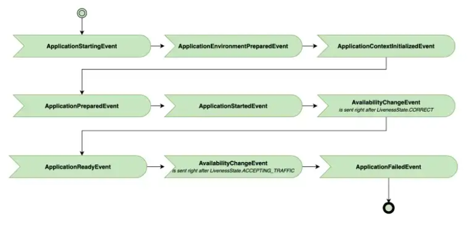

# Srping Application Events
- 이벤트 들의 실행 순서와 우선순위를 나타낸다
- ApplicationEnvironmentPreparedEvent 와 그 이전의 이벤트는 스프링 컨텍스트가 구성되기 전에 실행되어 Listener 등록을 @Bean 을 통해 할 수 없다
    - SpringApplication.addListener() 메서드를 통해 리스너를 등록 가능하다

## Reference
- [Spring Docs - 'Application Events and Listeners'](https://docs.spring.io/spring-boot/docs/current/reference/htmlsingle/#features.spring-application.application-events-and-listeners)
- [Blog - 'Spring Application Events'](https://semotpan.com/spring-application-events-7ab5390db6dd)