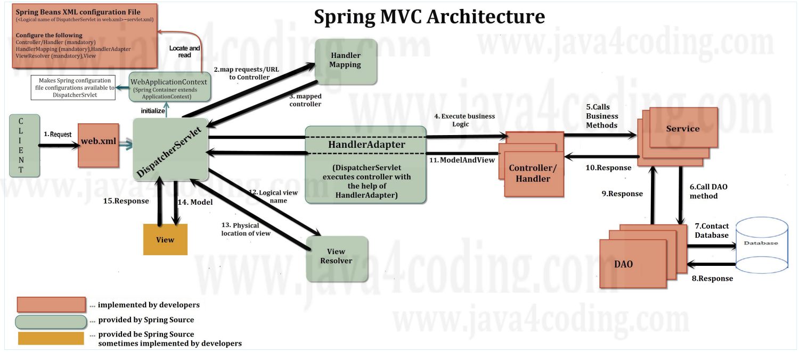

# Spring MVC Architecture

## Spring MVC Architecture Flow

- DispatcherServlet 이 요청을 받는다
    - HandlerMapping 객체를 통해 요청에 적합한 Controller(Handler) 가 무엇인지 찾는다
    - HandlerAdapter 객체를 통해 Controller 의 비즈니스 로직을 실행시킨다
        - Controller 가 실행 결과를 HandlerAdapter 에게 반환한다
    - ViewResolver 객체를 통해 view 이름에 해당하는 적합한 View(JSP, FreeMarker etc.) 를 찾아 반환한다
    - 반환받은 View(JSP, FreeMarker etc.) 를 통해 렌더링 프로세스를 진행한다

## Reference
- [Spring MVC Architecture](https://www.java4coding.com/contents/spring/spring-mvc-architecture)
- [View Resolver](https://enjoydevelop.tistory.com/103)