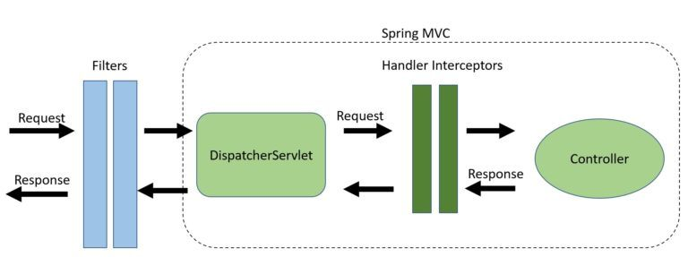

## 문제 발생
Jwt 로그인 기능을 소켓 통신에 적용시키면서 Authentication 오류 발생

## 발생 원인

- Interceptor vs Filter 에 대해 제대로 이해 하지 못해 발생한 오류
    - Interceptor : Spring Context 에서 작동하며 Filter 에 비해 더 정교한 처리가 가능하다.
    - Filter : Servlet Container 가 모든 HTTP 요청과 응답에 대해  실행 하는 자바 클래스이다. 요청이 리소스에 도달하기 전에 관리가 가능하며, HTTP 아웃바운드 응답을 관리할 수 있다.
- Filter 는 Interceptor 보다 선행하여 실행된다. Spring Security가 적용 되면서 WebSocket 연결 요청이 Filter 에서 인증을 통과하지 못해 발생한 오류

## 오류 해결
```C
public class SecurityConfig extends WebSecurityConfigurerAdapter {
	@Override
	protected void configure(HttpSecurity http) throws Exception {
		http
			.cors()
			.and()
		---생략---
			.antMatchers("/ws/**).permitAll()
		---생략---
		
	}
}
```
- Front-end 에서 다른 HTTP 요청과 같은 방법으로 Jwt 를 헤더에 넣어서 보내도, 결론적으로 토큰이 HTTP 헤더가 아닌 Message 헤더에 들어간 상태로 요청이 온다. 따라서 Securityfilter 에서 해당 요청의 인증을 진행할 수 없으므로 permitAll() 로 통과 시킨 후 Interceptor 에서 인증을 진행 한다.  

## 결론
- HTTP 통신과 Socket 통신 시 Jwt 가 들어가는 위치가 달라서 생긴 오류이다. HTTP 통신 시 HTTP 헤더에, Socket 통신 시 Message 헤더에 Jwt 가 들어간다

## 궁금한점
소켓 통신 시에도 HTTP 헤더에 Jwt 를 넣을 수 있는 방법은 없을까?