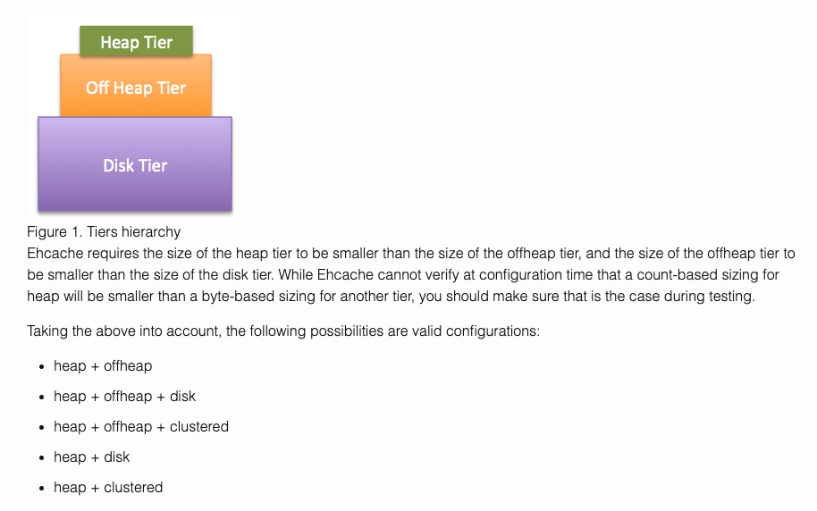
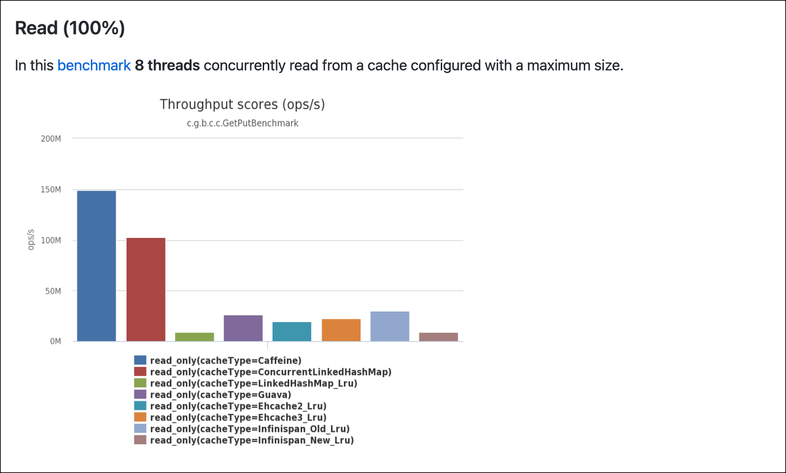
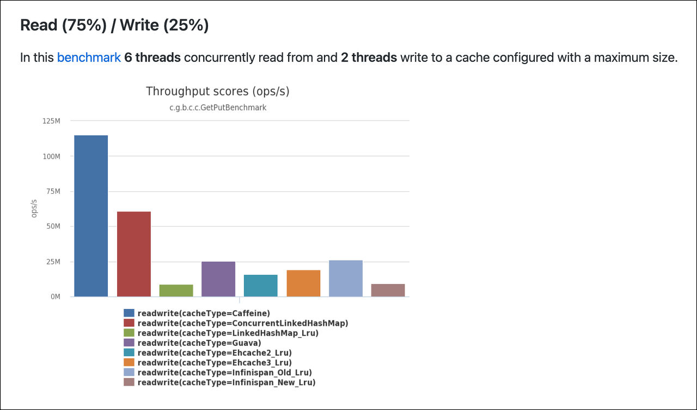
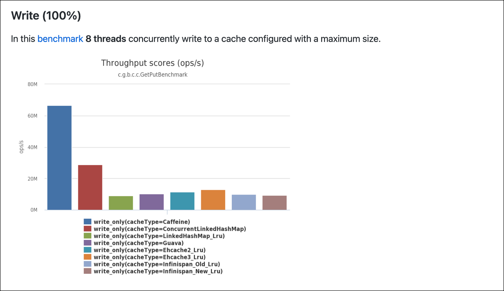

# EhCache vs CaffeineCache

## EhCache
- 직렬화된 데이터 객체를 저장하는 메모리 블럭
- 3가지 스토리지에 저장
    - 메모리 저장 공간 (in Memory)
    - Off Heap 공간
    - 디스크 공간

## CaffeineCache
- High Performance
- Guava Cache 와 ConcurrentHashMap 을 개선한 ConcurrentLinkedHashMap 을 바탕으로 만든 캐시

## Compare

- Ehcache 는 다양한 종류의 캐싱 방법을 제공한다.
- 하지만 캐싱 속도에 있어서는 CaffeineCache 가 더 좋은 성능을 보인다

## Reference
- [블로그 - 'Ehcache vs Caffeine Cache'](https://erjuer.tistory.com/127)
- [GitHub - 'caffeine cache'](https://github.com/ben-manes/caffeine)
- [Blog - 'Cache'](https://blog.devops.dev/easy-to-use-caffeine-cache-1-3db5861f6f39)