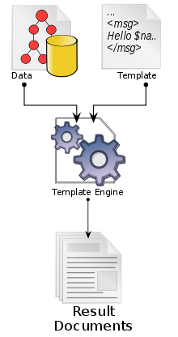

# Template Engine

- 템플릿과 데이터 모델을 합해 결과 문서를 만들어내는 소프트웨어다
	- 결과 문서란 웹페이지, 소스 코드, 문서 등 모든 결과물을 말한다
- 정적인 템플릿 파일을 애필르케이션에 사용하며 런타임에 해당 템플릿의 변수에 실제 값을 넣어주는 방식으로 작동한다.

## 사용 이유
- 애플리케이션 레이어를 나눌 수 있다
	- 비즈니스 로직과 프레젠테이션 레이어를 구분지을 수 있다
- 하나의 파일에 여러 종류의 프로그래밍 언어를 함께 사용할 필요가 없다
- 코드의 길이 감소
- 재사용성 증가
- 유지보수에 용이

## 종류
- JSP
- Thymeleaf
- FreeMarker

## Reference
- [블로그 - '템플릿 엔진'](https://code-lab1.tistory.com/211#:~:text=%ED%85%9C%ED%94%8C%EB%A6%BF%20%EC%97%94%EC%A7%84%EC%9D%B4%EB%9E%80%3F,%EB%90%98%EB%8A%94%20%ED%85%9C%ED%94%8C%EB%A6%BF%20%EC%97%94%EC%A7%84%EC%9D%84%20%EB%A7%90%ED%95%9C%EB%8B%A4.)
- [블로그 - 'Template Engine'](https://gmlwjd9405.github.io/2018/12/21/template-engine.html)
- [Blog - 'Template Engine'](https://medium.com/@hasithalgamge/template-engines-8c70ed36f732)
- [Wikipedia - 'Template processor'](https://en.wikipedia.org/wiki/Template_processor)